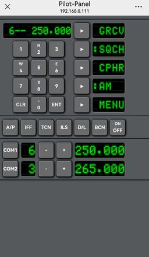
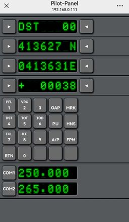

# Pilot-Panel

## 项目简介

此项目为了帮助X-Plane 12和DCS World玩家通过手机操作飞机内相关设备。
同时也为了鼓励玩家自己动手开发、制作自己“趁手的兵器”。

* gitee:  <https://gitee.com/helppass/pilot-panel.git>
* github: <https://github.com/helppass/PilotPanel.git>

### X-Plane 12

目前仅支持X-Plane 12.1.4及以上版本，因为使用到了12.1.4的Web API接口增加了输入指令“Command”的功能。在此版本之前Web API接口只能获取数据而不能发起交互，需要通过虚拟游戏设备发起，而游戏内外设置按键设置等操作太繁琐所以改为12.1.4。

### DCS World

使用DCS-BIOS接入游戏。它是通过DCS World标准的数据导出接口获取数据，不涉及游戏脚本改动，因此不会触发游戏内联网模式的绿盾检测失败，可放心使用。

## 安装方法

### 环境要求

* 执行环境Windows
* DCS World需要安装DCS-BIOS插件，具体安装方法可参考DCS-BIOS项目主页。
* 手机与电脑在同一局域网内，需要能直接通过IP访问电脑。

### 安装步骤

* 下载已打包的程序: <https://pan.baidu.com/s/1ulhzz3daNFtgL-QFZWPJHQ?pwd=7ep2>
* 解压缩到后，即可执行
* 程序默认服务端口为5600，如需变更则可以在config.ymal中修改

## 使用方法

### 快速开始

* 执行pilot-panel.exe文件
* 用微信浏览器访问 http\://电脑IP:5600。因手机浏览器可能有些奇怪的安全限制，例如禁止JavaScript、禁止websocket等，导致无法正常使用，所以建议使用微信内的浏览器，其他浏览器也可以试一下。
* 打开后看到的是设置界面，按照需要打开或关闭面板。
* 在空白处上滑或下滑切换界面。

PS：如果有Python开发环境则可执行main.py启动

#### Setting

按需开启或关闭面板

#### X-Plane CDU

目前仅支持X-Plane 12的原生737、A330和MD-82。CDU界面会依据当前飞机自动切换。

#### X-Plane 无线电界面

* 下方数字区可直接输入频率，输入后再点击上方COM/NAV等频率，则可设置对应项目的频率。
* "<<<"按钮为切换对应项目的频率和备用频率
* MHz和kHz按钮可上下或左右拖动调整频率

#### X-Plane 自动驾驶仪

自动驾驶仪界面按钮式基于X-Plane 12原版737的自动驾驶仪界面设计，其他机型适配可能有问题。
“|||”按钮可上下或左右拖动调整对应数值。

#### DCS FA-18C UFC

#### DCS JF-17 UFC

#### DCS F-16 UFC

本人没有购买F16，暂时按照视频里的样子简单制作了一个，有兴趣的可以自己修改一下。

## 文档

* Pyhon: <https://www.python.org>
* 阿里巴巴开源镜像：<https://developer.aliyun.com>
* 阿里巴巴Pipy镜像：<https://developer.aliyun.com/mirror/pypi>
* 阿里巴巴Npm镜像：<https://developer.aliyun.com/mirror/NPM>
* VSCode：<https://code.visualstudio.com/>
* 豆包编程助手：<https://www.marscode.cn/workbench/>
*
* DCS-BIOS 项目主页：<https://github.com/DCS-Skunkworks/dcs-bios>
* X-Plane 开发主页：<https://developer.x-plane.com/>
* X-Plane Web API 接口文档：<https://developer.x-plane.com/article/x-plane-web-api/>
* X-Plane DataRefs 游戏数据清单：<https://developer.x-plane.com/datarefs/>
* X-Plane 版本清单：<https://www.x-plane.com/knowledgebase_category/release-notes/>

## 常见问题解答（FAQ）

## 更新历史

* 2025-03-02 11:00 重新打包，之前的web/node_modules目录内容异常 <https://pan.baidu.com/s/1nwXDYXzTOt8eXzxktMEN_g?pwd=vkur>
* 2025-03-03 11:00 XPlane相关面板的Flex布局改为grid布局，频率数值字体改为点整字体
* 2025-03-08 10:00 按钮全改为g-btn组件, LED显示改为g-led组件，增加F16-UFC面板（试用）
